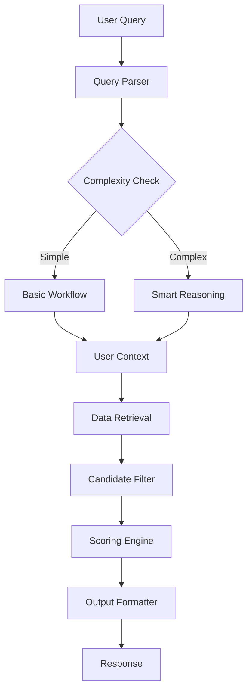

# Restaurant Recommendation System - Developer Documentation

## Table of Contents
1. [System Overview](#system-overview)
2. [Architecture](#architecture)
3. [Core Components](#core-components)
4. [Data Flow](#data-flow)
5. [API Reference](#api-reference)
6. [Configuration](#configuration)
7. [Installation & Setup](#installation--setup)
8. [Testing](#testing)
9. [Performance Optimization](#performance-optimization)
10. [Troubleshooting](#troubleshooting)
11. [Contributing](#contributing)

---

## System Overview

The Restaurant Recommendation System is an advanced, AI-powered recommendation engine that uses Large Language Models (LLMs) and graph-based workflows to provide intelligent restaurant suggestions. The system processes natural language queries and returns personalized recommendations based on user preferences, context, and real-time data.

### Key Features

- **🧠 LLM-Powered Query Understanding**: Pure natural language processing without hard-coded keywords
- **🎯 Dynamic Scoring Algorithm**: Adaptive 50/30/15/5 weighted scoring system
- **🍴 Smart Dietary Intelligence**: AI-based dietary compatibility assessment
- **🏗️ Graph-Based Workflow**: LangGraph orchestrated processing pipeline
- **🌐 Real-Time Data Integration**: Google Places API with intelligent caching
- **📊 Performance Monitoring**: Built-in metrics and health checks

### Technology Stack

- **Language**: Python 3.11+
- **Workflow Engine**: LangGraph
- **LLM Provider**: OpenAI GPT-4/3.5-turbo
- **Places API**: Google Places API
- **Data Validation**: Pydantic v2
- **Caching**: Redis/Memory adapters
- **Vector Database**: ChromaDB/MockAdapter
- **Testing**: Pytest with custom runners

---

## Architecture

### High-Level Architecture

```
┌─────────────────┐    ┌──────────────────┐    ┌─────────────────┐
│   User Query    │───▶│   Query Parser   │───▶│  User Context   │
│  Natural Lang   │    │   (LLM-based)    │    │   (Vector DB)   │
└─────────────────┘    └──────────────────┘    └─────────────────┘
                                                         │
┌─────────────────┐    ┌──────────────────┐    ┌─────────────────┐
│ Final Response  │◀───│ Output Formatter │◀───│ Data Retrieval  │
│   (Formatted)   │    │  (LLM-enhanced)  │    │ (Google Places) │
└─────────────────┘    └──────────────────┘    └─────────────────┘
         ▲                                               │
         │              ┌──────────────────┐             │
         └──────────────│ Scoring Engine   │◀────────────┘
                        │ (50/30/15/5 Alg) │
                        └──────────────────┘
                                 ▲
                        ┌──────────────────┐
                        │Candidate Filter  │
                        │(LLM Dietary AI)  │
                        └──────────────────┘
```

### Component Interaction Flow

1. **Query Parser** converts natural language to structured data using LLM reasoning
2. **User Context** retrieves user preferences and similar user profiles from vector DB
3. **Data Retrieval** fetches restaurant data from Google Places with smart caching
4. **Candidate Filter** applies quality filters and LLM-based dietary intelligence
5. **Scoring Engine** ranks restaurants using dynamic weighted scoring algorithm
6. **Output Formatter** generates human-readable responses with explanations

---

## Core Components

### 1. Query Parser (`QueryParserNode`)

**Purpose**: Converts natural language queries into structured `ParsedQuery` objects.

**Key Features**:
- **Zero hard-coded keywords** - Pure LLM understanding
- **Multi-step analysis**: Intent → Entities → Context → Confidence
- **Comprehensive extraction**: Cuisine, price, dietary, ambiance, social context
- **Fallback handling**: Graceful degradation if LLM fails

**Example Input/Output**:
```python
# Input
"I want cozy Italian food with outdoor seating for a romantic date tonight, vegetarian options, not too expensive"

# Output (ParsedQuery)
ParsedQuery(
    query_type=QueryType.CUISINE_SPECIFIC,
    confidence=1.0,
    cuisine_preferences=[RestaurantCategory.ITALIAN],
    price_preferences=[PriceLevel.MODERATE],
    dietary_requirements=[DietaryRestriction.VEGETARIAN],
    ambiance_preferences=[AmbiancePreference.ROMANTIC, AmbiancePreference.COZY],
    required_features=["outdoor_seating"],
    social_context=SocialContext(party_size=2, occasion="date"),
    time_preference=TimePreference(urgency=Urgency.TONIGHT)
)
```

**Implementation Notes**:
- Uses structured LLM prompts with step-by-step reasoning
- Implements intelligent enum mapping with fallback heuristics
- Calculates complexity scores for workflow routing decisions

### 2. Data Retrieval (`DataRetrievalNode`)

**Purpose**: Fetches restaurant data from external APIs with intelligent processing.

**Key Features**:
- **Google Places Integration**: Primary data source with real-time API calls
- **LLM-Based Cuisine Classification**: Dynamic cuisine detection using restaurant names
- **Smart Caching**: Multi-layer caching with TTL management
- **Error Resilience**: Graceful fallback to cached/mock data

**Data Flow**:
```python
# 1. Build search parameters from parsed query
search_params = {
    "location": user_location,
    "radius": 5000,
    "keyword": "italian",
    "type": "restaurant",
    "minprice": 2,
    "maxprice": 3
}

# 2. Fetch from Google Places API
places_response = await google_places_client.nearby_search(search_params)

# 3. Convert each place with LLM cuisine classification
for place in places_response:
    cuisine = await llm_classify_cuisine(place.name, place.types)
    restaurant = convert_to_restaurant_model(place, cuisine)
```

**Caching Strategy**:
- **Restaurant Data**: 30 minutes TTL
- **Google Places**: 15 minutes TTL  
- **LLM Classifications**: 24 hours TTL
- **User Preferences**: 1 hour TTL

### 3. Candidate Filter (`CandidateFilterNode`)

**Purpose**: Filters restaurants using quality standards and intelligent dietary matching.

**Key Features**:
- **Quality Filters**: Rating, review count, closure status
- **LLM Dietary Intelligence**: AI-powered dietary compatibility assessment
- **Cuisine Diversity**: Ensures variety in recommendations
- **Performance Optimization**: Limits candidates for efficient scoring

**LLM Dietary Assessment**:
```python
async def _llm_dietary_assessment(self, restaurant: Restaurant, dietary_requirements: List[str]) -> bool:
    """
    Uses LLM to analyze:
    - Restaurant name clues ("Green Leaf Cafe" = vegetarian-friendly)
    - Cuisine compatibility (Indian restaurants typically have vegan options)
    - Price level correlation (higher-end = more accommodating)
    - Menu focus indicators (BBQ smokehouse unlikely for vegans)
    """
    
    prompt = f"""
    Restaurant: {restaurant.name}
    Cuisine: {restaurant.primary_category.value}
    Dietary Requirements: {', '.join(dietary_requirements)}
    
    Assess compatibility and return: YES/NO/MAYBE
    """
    
    # Returns intelligent reasoning instead of hard-coded rules
```

**Quality Filter Thresholds**:
- **Minimum Rating**: 3.0/5.0 (configurable)
- **Minimum Reviews**: 5 reviews (configurable)
- **Status**: Exclude permanently closed
- **Diversity**: Max 60% same cuisine in results

### 4. Scoring Engine (`ScoringNode`)

**Purpose**: Ranks restaurants using a sophisticated 50/30/15/5 weighted algorithm.

**Scoring Breakdown**:
```
Total Score = (Preference × 0.50) + (Context × 0.30) + (Quality × 0.15) + (Boost × 0.05)

Preference Score (50%):
├── Cuisine Match (40%)
├── User Cuisine Preference Weight (30%)  
├── Price Match (20%)
└── Collaborative Filtering (10%)

Context Score (30%):
├── Time Appropriateness (40%)
├── Feature Match (35%)
├── Location Score (15%)
└── Occasion Match (10%)

Quality Score (15%):
├── Rating Score (60%)
├── Popularity Score (25%)
└── Review Quality (15%)

Boost Score (5%):
├── Popular Restaurant (+10%)
├── Trending (+5%)
├── Friend Recommendations (+15%)
└── Weather/Time Appropriate (+10%)
```

**Dynamic Adjustments**:
- **Context Queries**: Boost context relevance to 45%
- **Urgent Queries**: Prioritize proximity and availability
- **Price Queries**: Balance preference and quality scoring
- **Cuisine Queries**: Boost preference matching to 60%

### 5. Output Formatter (`OutputFormatterNode`)

**Purpose**: Generates human-readable responses with intelligent explanations.

**Key Features**:
- **Contextual Messaging**: Adapts tone to query type and urgency
- **Smart Explanations**: LLM-generated reasoning for recommendations
- **Performance Metrics**: Processing time, API calls, cache hits
- **Rich Formatting**: Structured JSON with restaurant details

**Response Structure**:
```json
{
  "success": true,
  "data": {
    "message": "Here are some restaurant options you might enjoy...",
    "recommendations": [
      {
        "restaurant": {
          "name": "Osteria Nonnino",
          "cuisine": "italian",
          "rating": 4.8,
          "price_level": "$$",
          "location": {"lat": 40.7128, "lng": -74.0060}
        },
        "recommendation": {
          "rank": 1,
          "score": 0.573,
          "confidence": 0.95,
          "explanation": "Highly rated Italian restaurant that matches your preferences",
          "reasons": ["cuisine_match", "highly_rated", "good_for_party_size"]
        }
      }
    ],
    "query_info": {
      "parsed_query_type": "cuisine_specific",
      "confidence_score": 1.0,
      "complexity_score": 0.3
    }
  },
  "performance": {
    "processing_time_ms": 5512,
    "api_calls": 1,
    "cache_hits": 1,
    "workflow_steps_completed": 6
  }
}
```

---

## Data Flow

### 1. Request Processing Flow



### 2. Data Dependencies

```
User Query
├── ParsedQuery (from LLM)
├── UserPreferences (from Vector DB)
├── SimilarUsers (from Vector DB)
├── NearbyRestaurants (from Google Places)
├── CandidateRestaurants (filtered)
├── ScoredRecommendations (ranked)
└── FinalRecommendations (formatted)
```

### 3. Caching Layers

```
Request → Cache Check → API Call → Cache Store → Response
          ↓ Hit           ↓ Miss      ↓ Success
          Response        Fallback    Update Cache
```

---

## API Reference

### Main Entry Point

```python
# Initialize workflow
workflow = await create_restaurant_recommendation_workflow(
    openai_api_key="your_openai_key",
    use_mock_services=False,  # Set True for development
    cache_adapter=cache_adapter  # Optional
)

# Get recommendations
result = await workflow.recommend_restaurants(
    user_query="Find me Italian food for dinner",
    user_id="user123",
    user_location=(40.7128, -74.0060)  # (lat, lng)
)
```

### Configuration Classes

```python
# LLM Configuration
@dataclass
class LLMConfig:
    models: Dict[str, str] = field(default_factory=lambda: {
        "query_parser": "gpt-3.5-turbo",
        "reasoning": "gpt-4",
        "embeddings": "text-embedding-3-large"
    })
    temperature: Dict[str, float] = field(default_factory=lambda: {
        "query_parser": 0.1,
        "reasoning": 0.3
    })

# API Configuration  
@dataclass
class APIConfig:
    google_places_api_key: str
    openai_api_key: str
    api_rate_limits: Dict[str, int] = field(default_factory=lambda: {
        "google_places": 100,  # requests per minute
        "openai": 60
    })
```

### Model Classes

```python
# Core models with validation
class ParsedQuery(BaseModel):
    original_query: str
    query_type: QueryType
    confidence: float = Field(ge=0, le=1)
    cuisine_preferences: List[RestaurantCategory] = []
    price_preferences: List[PriceLevel] = []
    dietary_requirements: List[DietaryRestriction] = []
    # ... additional fields

class Restaurant(BaseModel):
    place_id: str
    name: str
    primary_category: RestaurantCategory
    rating: float = Field(ge=0, le=5)
    price_level: Optional[PriceLevel] = None
    location: Location
    # ... additional fields

class Recommendation(BaseModel):
    restaurant: Restaurant
    score: ScoreBreakdown
    rank: int = Field(ge=1)
    explanation: str
    confidence: float = Field(ge=0, le=1)
    # ... additional fields
```

---

## Configuration

### Environment Variables

```bash
# Required
OPENAI_API_KEY=your_openai_api_key
GOOGLE_PLACES_API_KEY=your_google_places_key

# Optional
REDIS_URL=redis://localhost:6379
VECTOR_DB_TYPE=chroma  # or pinecone
ENVIRONMENT=development  # development, staging, production

# Performance
MAX_CONCURRENT_API_CALLS=10
DEFAULT_TIMEOUT_SECONDS=30
ENABLE_CACHING=true
```

### settings.py Configuration

```python
# Application settings
settings = Settings(
    environment=Environment.DEVELOPMENT,
    
    # API Configuration
    api=APIConfig(
        openai_api_key=os.getenv("OPENAI_API_KEY"),
        google_places_api_key=os.getenv("GOOGLE_PLACES_API_KEY")
    ),
    
    # LLM Configuration
    llm=LLMConfig(
        models={
            "query_parser": "gpt-3.5-turbo",
            "reasoning": "gpt-4"
        },
        temperature={
            "query_parser": 0.1,
            "reasoning": 0.3
        }
    ),
    
    # Recommendation Configuration
    recommendation=RecommendationConfig(
        scoring_weights={
            "preference_match": 0.50,
            "context_relevance": 0.30,
            "quality_score": 0.15,
            "boost_score": 0.05
        }
    )
)
```

---

## Installation & Setup

### Prerequisites

- Python 3.11+
- OpenAI API key
- Google Places API key
- Redis (optional, for production caching)

### Installation

```bash
# Clone repository
git clone <repository-url>
cd restaurant-recommendation-system

# Create virtual environment
python -m venv venv
source venv/bin/activate  # Linux/Mac
# or
venv\Scripts\activate     # Windows

# Install dependencies
pip install -r requirements.txt

# Install test dependencies (optional)
pip install -r requirements-test.txt
```

### Environment Setup

```bash
# Copy environment template
cp .env.example .env

# Edit .env file with your API keys
nano .env
```

### Development Setup

```bash
# Install in development mode
pip install -e .

# Setup pre-commit hooks
pre-commit install

# Run initial tests
python tests/test_runner.py
```

### Production Setup

```bash
# Install production dependencies only
pip install -r requirements-prod.txt

# Setup Redis
docker run -d -p 6379:6379 redis:alpine

# Setup environment
export ENVIRONMENT=production
export REDIS_URL=redis://localhost:6379
```

---

## Testing

### Test Structure

```
tests/
├── test_runner.py              # Custom test runner with reporting
├── conftest.py                 # Pytest fixtures and configuration
├── api_clients/
│   ├── test_google_places.py   # Google Places API integration
│   └── test_openai.py          # OpenAI client tests
├── agents/
│   ├── test_query_parser.py    # LLM query parsing tests
│   ├── test_scoring.py         # Scoring algorithm validation
│   └── test_workflow.py        # End-to-end workflow tests
├── databases/
│   ├── test_vector_db_mock.py  # Vector database tests
│   └── test_cache_adapters.py  # Cache system tests
└── integration/
    ├── test_performance.py     # Performance benchmarks
    └── test_api_comparison.py  # Mock vs real API comparison
```

### Running Tests

```bash
# Run all tests with custom runner (recommended)
python tests/test_runner.py

# Run with pytest
pytest tests/ -v

# Run specific test categories
pytest tests/agents/ -v                    # Agent tests only
pytest tests/api_clients/ -v              # API client tests only
pytest tests/ -m "not slow"               # Skip slow tests

# Performance testing
pytest tests/integration/test_performance.py --benchmark-only

# Generate coverage report
pytest tests/ --cov=src --cov-report=html
```

### Test Modes

```bash
# Mock mode (no API keys required)
TESTING_MODE=mock python tests/test_runner.py

# Real API mode (requires API keys)
TESTING_MODE=real python tests/test_runner.py

# Mixed mode (real APIs where available, mocks elsewhere)
TESTING_MODE=mixed python tests/test_runner.py
```

### Writing Tests

```python
# Example test for new functionality
import pytest
from src.agents.workflows.restaurant_recommendation import create_restaurant_recommendation_workflow

@pytest.mark.asyncio
async def test_new_feature(cache_adapter):
    """Test new feature functionality"""
    workflow = await create_restaurant_recommendation_workflow(
        openai_api_key="test_key",
        use_mock_services=True,
        cache_adapter=cache_adapter
    )
    
    result = await workflow.recommend_restaurants(
        user_query="test query",
        user_id="test_user",
        user_location=(40.7128, -74.0060)
    )
    
    assert result["success"]
    assert len(result["data"]["recommendations"]) > 0
```

---

## Performance Optimization

### Caching Strategy

```python
# Multi-layer caching implementation
class CacheStrategy:
    """
    L1: Memory cache (fastest, limited size)
    L2: Redis cache (fast, persistent)
    L3: Database cache (slower, permanent)
    """
    
    async def get_with_fallback(self, key: str):
        # Try L1 cache
        if result := await self.memory_cache.get(key):
            return result
            
        # Try L2 cache
        if result := await self.redis_cache.get(key):
            await self.memory_cache.set(key, result)
            return result
            
        # Fallback to source
        return None
```

### Database Optimization

```python
# Connection pooling
database_config = DatabaseConfig(
    max_connections=20,
    connection_timeout=30,
    pool_recycle=3600
)

# Query optimization
class OptimizedQueries:
    """Optimized database queries for performance"""
    
    @cached(ttl=3600)
    async def get_user_preferences(self, user_id: str):
        """Cached user preference lookup"""
        
    async def batch_restaurant_lookup(self, place_ids: List[str]):
        """Batch restaurant data retrieval"""
```

### API Rate Limiting

```python
# Intelligent rate limiting
class RateLimiter:
    async def acquire(self, key: str) -> bool:
        """Smart rate limiting with burst handling"""
        
    async def adaptive_delay(self, api_name: str):
        """Adaptive delays based on API response times"""
```

### Performance Monitoring

```python
# Built-in performance tracking
@performance_tracker
async def process_query(self, query: str):
    """Automatic performance monitoring"""
    
# Metrics collection
metrics = {
    "processing_time_ms": timer.elapsed(),
    "api_calls_made": api_counter.value,
    "cache_hit_ratio": cache.hit_ratio(),
    "memory_usage_mb": memory_tracker.usage()
}
```

### Optimization Guidelines

1. **Caching**: Cache at multiple levels with appropriate TTLs
2. **Batching**: Batch API calls when possible
3. **Parallel Processing**: Use asyncio for concurrent operations
4. **Memory Management**: Monitor and limit memory usage
5. **Database Indexing**: Index frequently queried fields
6. **Connection Pooling**: Reuse database connections
7. **Response Compression**: Compress large API responses

---

## Troubleshooting

### Common Issues

#### 1. API Rate Limiting

**Symptoms**:
```
ERROR: Rate limit exceeded for Google Places API
HTTP 429: Too Many Requests
```

**Solutions**:
```python
# Increase delays between requests
api_config.rate_limits["google_places"] = 50  # Reduce to 50/min

# Enable request queuing
api_config.enable_request_queue = True

# Use caching more aggressively
cache_config.ttl["google_places"] = 1800  # 30 minutes
```

#### 2. LLM Parsing Failures

**Symptoms**:
```
DEBUG: JSON decode failed, using fallback for: complex query
Parsed query confidence: 0.5
```

**Solutions**:
```python
# Adjust temperature for more consistent responses
llm_config.temperature["query_parser"] = 0.05

# Increase max_tokens for complex queries
llm_config.max_tokens["query_parser"] = 800

# Improve prompt engineering
system_prompt = "You are an expert parser. Return ONLY valid JSON..."
```

#### 3. Memory Issues

**Symptoms**:
```
MemoryError: Unable to allocate memory
High memory usage during processing
```

**Solutions**:
```python
# Limit concurrent processing
MAX_CONCURRENT_QUERIES = 5

# Implement memory cleanup
import gc
gc.collect()

# Reduce cache sizes
cache_config.max_size = 1000
```

#### 4. Database Connection Issues

**Symptoms**:
```
ConnectionError: Unable to connect to vector database
Timeout during database query
```

**Solutions**:
```python
# Increase connection timeout
database_config.connection_timeout = 60

# Add connection retry logic
@retry(attempts=3, delay=1)
async def connect_to_db():
    # Connection logic
    
# Use connection pooling
database_config.max_connections = 10
```

### Debug Mode

```python
# Enable comprehensive debugging
settings.debug = True
settings.verbose_scoring = True

# Detailed logging
logging.basicConfig(level=logging.DEBUG)

# Performance profiling
settings.profile_performance = True
```

### Health Checks

```python
# System health monitoring
async def health_check():
    return {
        "status": "healthy",
        "components": {
            "llm_client": await llm_client.health_check(),
            "places_api": await places_client.health_check(),
            "vector_db": await vector_db.health_check(),
            "cache": await cache.health_check()
        },
        "performance": {
            "avg_response_time": metrics.avg_response_time(),
            "success_rate": metrics.success_rate(),
            "cache_hit_ratio": metrics.cache_hit_ratio()
        }
    }
```

---

## Contributing

### Development Workflow

1. **Fork the repository**
2. **Create feature branch**: `git checkout -b feature/amazing-feature`
3. **Make changes with tests**
4. **Run test suite**: `python tests/test_runner.py`
5. **Update documentation**
6. **Submit pull request**

### Code Standards

```python
# Type hints required
async def process_query(query: str, user_id: str) -> RecommendationResult:
    """Process user query and return recommendations.
    
    Args:
        query: Natural language restaurant query
        user_id: Unique user identifier
        
    Returns:
        RecommendationResult with restaurants and metadata
        
    Raises:
        ValueError: If query is empty or invalid
        APIError: If external API calls fail
    """

# Comprehensive error handling
try:
    result = await api_call()
except APIError as e:
    logger.error(f"API call failed: {e}")
    return fallback_result()
except Exception as e:
    logger.exception(f"Unexpected error: {e}")
    raise
```

### Documentation Requirements

- **Docstrings**: All public methods must have comprehensive docstrings
- **Type Hints**: Required for all function signatures
- **Comments**: Complex logic should include explanatory comments
- **README Updates**: Update README.md for new features
- **API Documentation**: Update API reference for new endpoints

### Testing Requirements

- **Unit Tests**: All new functions require unit tests
- **Integration Tests**: New components require integration tests
- **Performance Tests**: Performance-critical changes need benchmarks
- **Coverage**: Maintain >90% test coverage

### Pull Request Checklist

- [ ] Tests pass locally
- [ ] Code follows style guidelines
- [ ] Documentation updated
- [ ] No breaking changes (or properly documented)
- [ ] Performance impact assessed
- [ ] Security considerations reviewed

---

## Future Development

### Planned Features

1. **Dynamic Configuration Management**
   - Auto-tuning scoring weights based on user feedback
   - A/B testing framework for algorithm improvements
   - Real-time configuration updates

2. **Advanced Personalization**
   - User behavior learning and adaptation
   - Social recommendation features
   - Seasonal and trending recommendations

3. **Enhanced Intelligence**
   - Multi-modal understanding (images, voice)
   - Conversational interfaces
   - Predictive recommendations

4. **Scalability Improvements**
   - Microservices architecture
   - Horizontal scaling capabilities
   - Global deployment support

### Architecture Evolution

```
Current: Monolithic LangGraph workflow
Future: Microservices with API gateway

┌─────────────┐    ┌─────────────┐    ┌─────────────┐
│   Query     │    │   User      │    │   Places    │
│  Service    │    │  Service    │    │  Service    │
└─────────────┘    └─────────────┘    └─────────────┘
        │                  │                  │
        └──────────────────┼──────────────────┘
                          │
                ┌─────────────┐
                │  Scoring    │
                │  Service    │
                └─────────────┘
```

### Technology Roadmap

- **Vector Database**: Migration to Pinecone for production scale
- **Real-time Features**: WebSocket support for live recommendations  
- **Machine Learning**: Custom ML models for specialized recommendation tasks
- **Global Deployment**: Multi-region deployment with edge caching

---

## License

This project is licensed under the MIT License - see the [LICENSE](LICENSE) file for details.

---